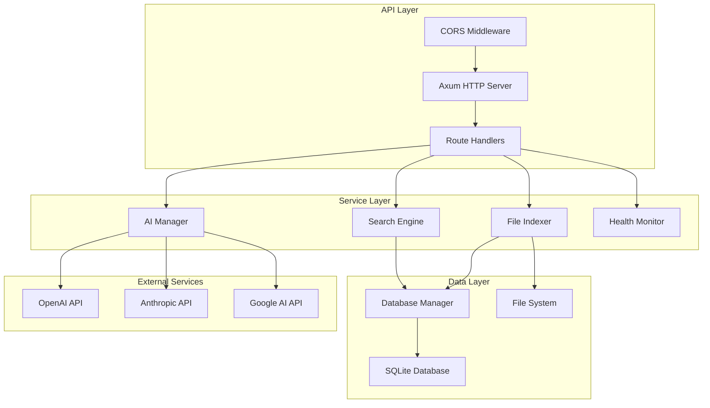

# Design Document

## Overview

The Backend System is a high-performance file indexing and search service built with Rust, leveraging the Axum web framework for HTTP handling and SQLite for data persistence. The system follows a modular architecture with clear separation of concerns across file indexing, search capabilities, AI integration, and API management.

The design emphasizes performance through asynchronous processing, efficient content chunking strategies, and optimized database indexing. The system supports multiple AI providers for enhanced semantic search capabilities while maintaining backward compatibility with traditional text-based search methods.

## Architecture

The system follows a layered architecture pattern with the following key components:



### Component Responsibilities

- **API Layer**: Handles HTTP requests, CORS, and routing using Axum framework
- **Service Layer**: Contains business logic for search, indexing, AI integration, and monitoring
- **Data Layer**: Manages data persistence and file system operations
- **External Services**: Integrates with third-party AI providers for enhanced capabilities

## Components and Interfaces

### AppState Structure

The central application state manages shared resources across all components:

```rust
#[derive(Clone)]
pub struct AppState {
    config: Arc<AppConfig>,
    db: Database,
    ai_manager: AIManager,
    indexer: FileIndexer,
    search_engine: SearchEngine,
}
```

### File Indexer Component

**Interface**: Provides file discovery, content extraction, and indexing capabilities

**Key Methods**:
- `start_full_index()`: Initiates complete directory scanning and indexing
- `index_file(path)`: Processes individual files for content extraction and storage
- `should_exclude_file(path)`: Applies exclusion rules based on configuration
- `create_chunks(content)`: Segments content into searchable chunks with overlap

**Content Processing Strategy**:
- Supports text-based formats: txt, md, rs, js, ts, py, html, css, json, xml, yml, yaml
- PDF text extraction using specialized libraries
- Future extensibility for additional document formats
- Content chunking with 1000-character segments and 200-character overlap for optimal search performance

### Search Engine Component

**Interface**: Provides multi-modal search capabilities across indexed content

**Search Strategies**:
1. **Content Search**: Full-text search across content chunks using SQL LIKE operations
2. **Filename Search**: Pattern matching against file names and paths
3. **Semantic Search**: AI-powered similarity search using vector embeddings (future enhancement)

**Result Processing**:
- Deduplication by file path to prevent duplicate results
- Relevance scoring based on match type and content similarity
- Snippet generation with context around query matches
- Performance tracking with execution time measurement

### AI Manager Component

**Interface**: Manages multiple AI provider integrations for enhanced search capabilities

**Provider Detection Logic**:
- OpenAI: API keys starting with "sk-"
- Anthropic: API keys starting with "sk-ant-"
- Google AI: API keys starting with "AIza"

**Model Management**:
- Dynamic model fetching from provider APIs with fallback to predefined lists
- Provider-specific embedding model configuration
- Error handling for API failures and invalid credentials

### Database Component

**Interface**: Provides data persistence and query capabilities using SQLite

**Schema Design**:
- `files` table: Stores file metadata with path-based uniqueness
- `content_chunks` table: Stores segmented content with foreign key relationships
- `search_history` table: Tracks search queries and performance metrics
- `ai_configs` table: Manages AI provider configurations

**Performance Optimizations**:
- B-tree indexes on frequently queried columns (path, modified_at, content)
- Efficient INSERT OR REPLACE operations for file updates
- Binary blob storage for embedding vectors with proper serialization

## Data Models

### FileRecord Structure

```rust
#[derive(Debug, Serialize, Deserialize, Clone)]
pub struct FileRecord {
    pub id: String,           // UUID for unique identification
    pub path: String,         // Absolute file path (unique constraint)
    pub name: String,         // File name for display and search
    pub size: i64,           // File size in bytes
    pub modified_at: DateTime<Utc>, // Last modification timestamp
    pub content_hash: String, // SHA256 hash for change detection
    pub mime_type: String,    // MIME type for content handling
    pub indexed_at: DateTime<Utc>, // Indexing timestamp
}
```

### ContentChunk Structure

```rust
#[derive(Debug, Serialize, Deserialize)]
pub struct ContentChunk {
    pub id: String,           // UUID for unique identification
    pub file_id: String,      // Foreign key to parent file
    pub chunk_index: i32,     // Sequential order within file
    pub content: String,      // Extracted text content
    pub embedding: Option<Vec<f32>>, // Vector embedding for semantic search
}
```

### SearchResult Structure

```rust
#[derive(Debug, Serialize, Deserialize, Clone)]
pub struct SearchResult {
    pub file: FileRecord,     // Complete file metadata
    pub score: f32,          // Relevance score (0.0-1.0)
    pub snippet: String,     // Context snippet with query highlights
    pub match_type: String,  // "content", "filename", or "semantic"
}
```

## Correctness Properties

*A property is a characteristic or behavior that should hold true across all valid executions of a system-essentially, a formal statement about what the system should do. Properties serve as the bridge between human-readable specifications and machine-verifiable correctness guarantees.*

### Property Reflection

After analyzing all acceptance criteria, several properties can be consolidated to eliminate redundancy:

- Provider-specific detection examples (3.2, 3.3, 3.4) are covered by the general provider detection property (3.1)
- Provider-specific embedding examples (3.8, 3.9) are covered by the general embedding property (3.7)
- Multiple startup configuration examples (6.1, 6.2, 6.5, 6.6, 6.7) can be consolidated into system initialization properties
- Performance and architectural properties (8.1, 8.6) are not easily testable and focus on implementation details

### Converting EARS to Properties

Property 1: File metadata extraction completeness
*For any* discovered file, when processed by the File_Indexer, all required metadata fields (path, name, size, modification time, MIME type) should be extracted and stored
**Validates: Requirements 1.2**

Property 2: Content extraction by format
*For any* text-based file of supported formats, the File_Indexer should successfully extract readable content
**Validates: Requirements 1.3, 1.4**

Property 3: File exclusion pattern matching
*For any* file path and exclusion pattern configuration, files matching exclusion rules should be skipped during indexing
**Validates: Requirements 1.5**

Property 4: Content chunking consistency
*For any* extracted file content, the File_Indexer should create chunks of approximately 1000 characters with 200-character overlap
**Validates: Requirements 1.6, 8.4**

Property 5: Content hash calculation
*For any* file content, the File_Indexer should calculate and store a consistent SHA256 hash for change detection
**Validates: Requirements 1.7**

Property 6: File change detection
*For any* file that has been modified since last indexing, the File_Indexer should re-index the file with updated content
**Validates: Requirements 1.8, 8.2**

Property 7: Search execution across content
*For any* search query, the Search_Engine should perform content-based search across all indexed file chunks
**Validates: Requirements 2.1**

Property 8: Filename search matching
*For any* search query, the Search_Engine should match queries against file names and paths when performing filename search
**Validates: Requirements 2.2**

Property 9: Search result deduplication
*For any* search operation returning multiple results, the Search_Engine should deduplicate results by file path
**Validates: Requirements 2.3**

Property 10: Search result ranking
*For any* set of search results, the Search_Engine should prioritize results by relevance score and modification time
**Validates: Requirements 2.4**

Property 11: Search snippet generation
*For any* search result with content matches, the Search_Engine should extract relevant content portions around query matches
**Validates: Requirements 2.5**

Property 12: Search result structure completeness
*For any* search operation, returned results should include file metadata, match type, and relevance score
**Validates: Requirements 2.7**

Property 13: Search performance tracking
*For any* search operation, the Search_Engine should measure and return query execution time
**Validates: Requirements 2.8, 8.5**

Property 14: AI provider detection by key format
*For any* API key provided, the AI_Manager should correctly detect the provider type based on key format patterns
**Validates: Requirements 3.1**

Property 15: AI model fetching on successful detection
*For any* successful provider detection, the AI_Manager should attempt to fetch available models from the provider's API
**Validates: Requirements 3.5**

Property 16: AI embedding generation with provider models
*For any* embedding generation request, the AI_Manager should use the appropriate provider-specific embedding model
**Validates: Requirements 3.7**

Property 17: Database file storage with upsert behavior
*For any* file record storage operation, the Database should use INSERT OR REPLACE to handle updates efficiently
**Validates: Requirements 4.2**

Property 18: Database foreign key integrity
*For any* content chunk storage operation, the Database should maintain foreign key relationships to parent files
**Validates: Requirements 4.3**

Property 19: Database embedding serialization round-trip
*For any* embedding data, the Database should store and retrieve embeddings as binary blobs with proper serialization
**Validates: Requirements 4.4**

Property 20: Database content search operations
*For any* content search query, the Database should use LIKE operations for text matching across chunks
**Validates: Requirements 4.5**

Property 21: Database datetime parsing round-trip
*For any* file record retrieval, the Database should parse stored datetime strings back to proper DateTime objects
**Validates: Requirements 4.6**

Property 22: Database cascade deletion
*For any* file record deletion, the Database should cascade delete associated content chunks
**Validates: Requirements 4.8**

Property 23: API health endpoint response structure
*For any* health check request, the Backend_System should return service status and component health information
**Validates: Requirements 5.2**

Property 24: API provider detection endpoint behavior
*For any* AI provider detection request, the Backend_System should validate API keys and return provider information
**Validates: Requirements 5.3**

Property 25: API search endpoint processing
*For any* file search request, the Backend_System should process query parameters and return search results
**Validates: Requirements 5.4**

Property 26: API CORS header handling
*For any* CORS preflight request, the Backend_System should allow requests from configured origins
**Validates: Requirements 5.7**

Property 27: API error response formatting
*For any* failed request processing, the Backend_System should return appropriate HTTP status codes and error messages
**Validates: Requirements 5.8**

Property 28: File exclusion by default patterns
*For any* file processing operation, the Backend_System should exclude common development and cache directories by default
**Validates: Requirements 6.3, 6.8**

Property 29: File pattern matching support
*For any* exclusion pattern check, the Backend_System should support both exact matches and simple glob patterns
**Validates: Requirements 6.4**

Property 30: Indexing error resilience
*For any* file access failure during indexing, the File_Indexer should log warnings and continue processing other files
**Validates: Requirements 7.1**

Property 31: Database error response formatting
*For any* database operation failure, the Backend_System should return appropriate error responses with descriptive messages
**Validates: Requirements 7.3**

Property 32: Network timeout handling
*For any* network request timeout, the Backend_System should handle timeouts gracefully without crashing
**Validates: Requirements 7.5**

Property 33: AI key validation error messaging
*For any* invalid API key provided, the AI_Manager should return clear error messages about key format issues
**Validates: Requirements 7.6**

Property 34: Search input validation
*For any* search query with invalid parameters, the Search_Engine should validate inputs and return meaningful error responses
**Validates: Requirements 7.7**

Property 35: Search result limiting
*For any* search execution, the Search_Engine should limit result sets to prevent excessive memory usage
**Validates: Requirements 8.3**

Property 36: System health monitoring
*For any* health monitoring operation, the Health_Monitor should check database connectivity and indexer status
**Validates: Requirements 8.7**

Property 37: Structured logging output
*For any* system activity, the Backend_System should use structured logging with appropriate log levels
**Validates: Requirements 8.8**

## Error Handling

The system implements comprehensive error handling across all layers:

### File Processing Errors
- **File Access Failures**: Log warnings and continue processing other files to maintain system resilience
- **Content Extraction Failures**: Skip problematic files (e.g., corrupted PDFs) and continue indexing
- **Permission Errors**: Handle access denied scenarios gracefully with appropriate logging

### Database Errors
- **Connection Failures**: Implement retry logic with exponential backoff for transient failures
- **Constraint Violations**: Return descriptive error messages for data integrity issues
- **Transaction Failures**: Rollback incomplete operations and maintain data consistency

### Network and API Errors
- **Timeout Handling**: Implement configurable timeouts for external API calls
- **Rate Limiting**: Handle API rate limits with appropriate retry strategies
- **Authentication Failures**: Provide clear error messages for invalid API keys

### Input Validation Errors
- **Query Parameter Validation**: Validate search parameters and return meaningful error responses
- **File Path Validation**: Sanitize and validate file paths to prevent security issues
- **Configuration Validation**: Validate configuration parameters at startup

## Testing Strategy

The testing approach combines unit testing and property-based testing to ensure comprehensive coverage:

### Unit Testing
- **Component Integration**: Test interactions between major components (Database, Search Engine, AI Manager)
- **API Endpoint Testing**: Verify HTTP endpoints return correct responses and status codes
- **Error Condition Testing**: Test specific error scenarios and edge cases
- **Configuration Testing**: Verify system behavior with different configuration options

### Property-Based Testing
- **File Processing Properties**: Test file indexing behavior across various file types and sizes
- **Search Properties**: Verify search correctness across different query patterns and content types
- **Database Properties**: Test data persistence and retrieval consistency
- **AI Integration Properties**: Verify provider detection and model management across different API key formats

### Testing Configuration
- **Property Test Iterations**: Minimum 100 iterations per property test for statistical confidence
- **Test Data Generation**: Smart generators that create realistic file structures and content
- **Performance Testing**: Measure and validate search performance characteristics
- **Integration Testing**: End-to-end testing of complete indexing and search workflows

### Test Tagging Format
Each property-based test must include a comment referencing the design document property:
```rust
// Feature: backend-system, Property 1: File metadata extraction completeness
```

The testing strategy ensures both functional correctness through property-based testing and practical reliability through comprehensive unit testing of edge cases and error conditions.