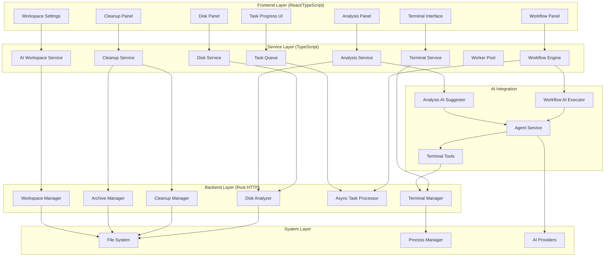

# Design Document

## Overview

The Skhoot v0.1.5 release transforms Skhoot into a comprehensive GUI for CLI agents with unrestricted system access. The design integrates four major subsystems: AI-Terminal Integration for programmatic command execution, AI Workspace Management for persistent agent operations, Disk Management with analysis and cleanup capabilities, Workflow Automation with real AI execution, and Asynchronous AI Operations for responsive user experience.

The architecture follows a layered approach with clear separation between frontend React components, backend Rust services, and AI integration layers. All backend services are implemented in the `/backend` directory (not `src-tauri`) using HTTP APIs for communication. The system emphasizes user control, safety mechanisms, and real-time feedback while enabling powerful automation capabilities.

## Architecture

The system follows a multi-tier architecture with distinct layers for UI, services, backend, and AI integration:



### Component Responsibilities

- **Frontend Layer**: React components for user interaction and visualization
- **Service Layer**: TypeScript services managing state and coordinating backend calls
- **Backend Layer**: Rust HTTP services for performant system operations
- **AI Integration**: AI agent tools and executors for intelligent automation
- **System Layer**: OS-level file system, process management, and AI provider APIs


## Components and Interfaces

### Terminal Tools (AI Integration)

**Responsibilities**: Provide AI agents with programmatic terminal control

**Tool Definitions**:
```typescript
interface TerminalTools {
  create_terminal(): Promise<{ sessionId: string }>;
  execute_command(sessionId: string, command: string): Promise<{ success: boolean }>;
  read_output(sessionId: string): Promise<{ output: string[], status: string }>;
  list_terminals(): Promise<{ terminals: TerminalInfo[] }>;
  inspect_terminal(sessionId: string): Promise<{ state: TerminalState }>;
}

interface TerminalInfo {
  sessionId: string;
  status: 'running' | 'completed' | 'error';
  createdBy: 'user' | 'ai';
  workspaceRoot: string;
}

interface TerminalState {
  sessionId: string;
  status: string;
  commandHistory: string[];
  currentOutput: string[];
  workspaceRoot: string;
}
```

**Integration with Agent Service**:
- Tools registered in agent session on startup
- Terminal output streamed to AI context in real-time
- Structured error messages for AI retry logic
- Command history maintained for context

### AI Workspace Service

**Responsibilities**: Manage AI workspace directory structure and configuration

**Key Methods**:
```typescript
interface AIWorkspaceService {
  initializeWorkspace(location?: string): Promise<void>;
  getWorkspaceInfo(): Promise<WorkspaceInfo>;
  setWorkspaceRoot(path: string): Promise<void>;
  migrateWorkspace(newLocation: string): Promise<void>;
  cleanupWorkspace(): Promise<CleanupResult>;
  readAGENTSmd(): Promise<string | null>;
  writeAGENTSmd(content: string): Promise<void>;
}

interface WorkspaceInfo {
  root: string;
  size: number;
  fileCount: number;
  hasAGENTSmd: boolean;
  subdirectories: {
    memory: string;
    generated: string;
    temp: string;
    logs: string;
  };
}
```

**Directory Structure**:
```
~/.skhoot/workspace/
├── memory/          # AI persistent memory
├── generated/       # AI-generated files with timestamps
├── temp/            # Temporary files (cleaned up)
└── logs/            # AI operation logs
```

**AGENTS.md Support**:
- Checked on agent session start
- Content included in agent system prompt
- Reloaded for new sessions when updated
- Template provided for user creation

### Disk Service

**Responsibilities**: Real-time disk monitoring and visualization data

**Key Methods**:
```typescript
interface DiskService {
  startMonitoring(): void;
  stopMonitoring(): void;
  getDiskUsage(): Promise<DiskUsage[]>;
  getVisualizationData(path: string): Promise<VisualizationData>;
  subscribeToUpdates(callback: (usage: DiskUsage[]) => void): void;
}

interface DiskUsage {
  drive: string;
  totalSize: number;
  usedSpace: number;
  freeSpace: number;
  percentage: number;
  warningLevel: 'normal' | 'warning' | 'critical';
}

interface VisualizationData {
  barChart: BarChartData;
  pieChart: PieChartData;
  largestDirectories: DirectoryInfo[];
  breadcrumbs: string[];
}
```

**Real-Time Updates**:
- Polls backend every 5 seconds for changes
- Emits events to subscribed components
- Caches visualization data for performance
- Provides drill-down navigation


### Analysis Service

**Responsibilities**: Coordinate disk analysis and provide AI-powered suggestions

**Key Methods**:
```typescript
interface AnalysisService {
  runAnalysis(paths: string[]): Promise<AnalysisReport>;
  getFileTypeBreakdown(): Promise<FileTypeBreakdown>;
  findLargeFiles(threshold: number): Promise<LargeFile[]>;
  findDuplicates(): Promise<DuplicateGroup[]>;
  getAISuggestions(): Promise<OptimizationSuggestion[]>;
  cacheResults(report: AnalysisReport): void;
  getCachedResults(): AnalysisReport | null;
}

interface AnalysisReport {
  timestamp: Date;
  totalSize: number;
  fileCount: number;
  fileTypeBreakdown: FileTypeBreakdown;
  largeFiles: LargeFile[];
  duplicates: DuplicateGroup[];
  suggestions: OptimizationSuggestion[];
}

interface FileTypeBreakdown {
  categories: {
    name: string;
    size: number;
    percentage: number;
    fileCount: number;
    files: FileInfo[];
  }[];
}

interface LargeFile {
  path: string;
  size: number;
  type: string;
  lastAccessed: Date;
  rarelyUsed: boolean;
  thumbnail?: string;
}

interface DuplicateGroup {
  hash: string;
  files: FileInfo[];
  totalSize: number;
  reclaimableSpace: number;
  original: string;
}

interface OptimizationSuggestion {
  id: string;
  type: 'delete' | 'compress' | 'archive' | 'move';
  rationale: string;
  estimatedSavings: number;
  riskLevel: 'safe' | 'moderate' | 'risky';
  affectedFiles: string[];
  dismissed: boolean;
}
```

**AI Integration**:
- Uses Agent Service to generate optimization suggestions
- Considers file types, sizes, access patterns, duplicates
- Ranks suggestions by potential space savings
- Caches suggestions for 24 hours

### Cleanup Service

**Responsibilities**: Execute cleanup operations with safety mechanisms

**Key Methods**:
```typescript
interface CleanupService {
  executeCleanup(items: CleanupItem[], action: CleanupAction): Promise<CleanupResult>;
  batchDelete(items: CleanupItem[]): Promise<CleanupResult>;
  batchArchive(items: CleanupItem[], destination: string): Promise<CleanupResult>;
  getHistory(): Promise<CleanupHistoryEntry[]>;
  undo(historyId: string): Promise<RestoreResult>;
  restore(archiveId: string, files: string[]): Promise<RestoreResult>;
  subscribeToProgress(callback: (progress: CleanupProgress) => void): void;
}

interface CleanupItem {
  path: string;
  size: number;
  category: 'temp' | 'cache' | 'old_downloads' | 'duplicates';
}

type CleanupAction = 'delete' | 'archive' | 'compress';

interface CleanupResult {
  success: boolean;
  processedCount: number;
  failedCount: number;
  spaceFreed: number;
  failedItems: { path: string; error: string }[];
  historyId: string;
}

interface CleanupHistoryEntry {
  id: string;
  timestamp: Date;
  action: CleanupAction;
  fileCount: number;
  spaceFreed: number;
  canUndo: boolean;
  expiresAt: Date;
  files: string[];
}

interface CleanupProgress {
  processedCount: number;
  totalCount: number;
  currentFile: string;
  spaceFreed: number;
}
```

**Safety Mechanisms**:
- Moves files to trash (not permanent delete)
- Requires explicit confirmation for batch operations
- Tracks history for 30-day undo period
- Verifies archive integrity before deleting originals
- Provides pause/resume for large operations


### Workflow Engine

**Responsibilities**: Execute multi-step workflows with AI integration

**Key Methods**:
```typescript
interface WorkflowEngine {
  executeWorkflow(workflow: Workflow): Promise<WorkflowResult>;
  pauseWorkflow(workflowId: string): Promise<void>;
  resumeWorkflow(workflowId: string): Promise<void>;
  cancelWorkflow(workflowId: string): Promise<void>;
  getWorkflowState(workflowId: string): Promise<WorkflowState>;
  subscribeToEvents(callback: (event: WorkflowEvent) => void): void;
}

interface Workflow {
  id: string;
  name: string;
  steps: WorkflowStep[];
  context: Record<string, any>;
}

interface WorkflowStep {
  id: string;
  type: 'ai' | 'command' | 'conditional' | 'transform';
  prompt?: string;
  command?: string;
  condition?: string;
  transform?: (input: any) => any;
}

interface WorkflowResult {
  workflowId: string;
  status: 'completed' | 'failed' | 'cancelled';
  stepResults: StepResult[];
  finalResult: any;
  duration: number;
}

interface StepResult {
  stepId: string;
  status: 'completed' | 'failed' | 'skipped';
  result: any;
  error?: string;
  duration: number;
}

interface WorkflowState {
  workflowId: string;
  currentStep: number;
  totalSteps: number;
  status: 'running' | 'paused' | 'completed' | 'failed';
  context: Record<string, any>;
}
```

**AI Integration**:
- Calls Agent Service for AI steps
- Passes context from previous steps
- Maintains conversation context across steps
- Retries with clarification on invalid results
- Allows tool execution within workflow context

**Template System**:
```typescript
interface WorkflowTemplate {
  id: string;
  name: string;
  description: string;
  category: 'demo' | 'user' | 'builtin';
  parameters: TemplateParameter[];
  steps: WorkflowStep[];
  usageCount: number;
}

interface TemplateParameter {
  name: string;
  type: 'string' | 'number' | 'path' | 'boolean';
  required: boolean;
  default?: any;
  description: string;
}
```

**Demo Templates**:
- Disk cleanup workflow
- Code analysis workflow
- File organization workflow
- Educational tooltips for each step
- Safe operations that don't modify important files

### Task Queue

**Responsibilities**: Manage asynchronous AI operations

**Key Methods**:
```typescript
interface TaskQueue {
  enqueue(task: Task): Promise<string>;
  cancel(taskId: string): Promise<void>;
  getTask(taskId: string): Promise<TaskInfo>;
  listActiveTasks(): Promise<TaskInfo[]>;
  getHistory(): Promise<TaskInfo[]>;
  subscribeToProgress(taskId: string, callback: (progress: TaskProgress) => void): void;
}

interface Task {
  type: string;
  priority: 'high' | 'normal' | 'low';
  payload: any;
  timeout?: number;
}

interface TaskInfo {
  id: string;
  type: string;
  status: 'queued' | 'running' | 'completed' | 'failed' | 'cancelled';
  priority: 'high' | 'normal' | 'low';
  progress: number;
  result?: any;
  error?: string;
  createdAt: Date;
  startedAt?: Date;
  completedAt?: Date;
  duration?: number;
}

interface TaskProgress {
  taskId: string;
  progress: number;
  phase: string;
  message: string;
  estimatedTimeRemaining?: number;
}
```

**Queue Management**:
- Priority-based execution (high > normal > low)
- Exponential backoff retry (up to 3 times)
- Result caching with TTL
- Persistence for resume on restart
- Queue capacity limits with rejection

### Worker Pool

**Responsibilities**: Handle concurrent AI requests with rate limiting

**Key Methods**:
```typescript
interface WorkerPool {
  submitRequest(request: AIRequest): Promise<string>;
  getWorkerHealth(): Promise<WorkerHealth[]>;
  adjustPoolSize(size: number): Promise<void>;
  getRateLimitStatus(provider: string): Promise<RateLimitStatus>;
}

interface AIRequest {
  provider: string;
  model: string;
  messages: Message[];
  tools?: Tool[];
  temperature?: number;
}

interface WorkerHealth {
  workerId: string;
  status: 'healthy' | 'unhealthy' | 'busy';
  requestCount: number;
  errorCount: number;
  lastError?: string;
}

interface RateLimitStatus {
  provider: string;
  requestsRemaining: number;
  resetsAt: Date;
  delayRequired: number;
}
```

**Concurrency Management**:
- Configurable pool size (default: 3 workers)
- Per-provider rate limit tracking
- Automatic worker health monitoring
- Request queuing when at capacity
- Dynamic pool size adjustment based on system resources


## Data Models

### Backend API Contracts

**Terminal Manager API** (`/backend/src/terminal/`):
```rust
// POST /api/terminal/create
CreateTerminalRequest { workspace_root: Option<String> }
CreateTerminalResponse { session_id: String }

// POST /api/terminal/execute
ExecuteCommandRequest { session_id: String, command: String }
ExecuteCommandResponse { success: bool }

// GET /api/terminal/output/{session_id}
TerminalOutput { lines: Vec<OutputLine>, status: String }

// GET /api/terminal/list
TerminalList { terminals: Vec<TerminalInfo> }

// GET /api/terminal/state/{session_id}
TerminalState { /* as defined above */ }
```

**Disk Analyzer API** (`/backend/src/disk_analyzer/`):
```rust
// POST /api/disk/analyze
AnalyzeRequest { paths: Vec<String>, options: AnalysisOptions }
AnalysisReport { /* as defined above */ }

// GET /api/disk/usage
DiskUsageResponse { drives: Vec<DiskUsage> }

// POST /api/disk/duplicates
FindDuplicatesRequest { paths: Vec<String> }
DuplicatesResponse { groups: Vec<DuplicateGroup> }
```

**Cleanup Manager API** (`/backend/src/cleanup/`):
```rust
// POST /api/cleanup/delete
DeleteRequest { items: Vec<CleanupItem>, use_trash: bool }
CleanupResult { /* as defined above */ }

// POST /api/cleanup/archive
ArchiveRequest { items: Vec<CleanupItem>, destination: String, compression: String }
ArchiveResult { archive_path: String, compression_ratio: f64 }

// POST /api/cleanup/restore
RestoreRequest { history_id: String }
RestoreResult { restored_count: usize, failed_count: usize }

// GET /api/cleanup/history
HistoryResponse { entries: Vec<CleanupHistoryEntry> }

// WebSocket /api/cleanup/progress
ProgressEvent { processed: usize, total: usize, current_file: String }
```

**Async Task Processor API** (`/backend/src/async_tasks/`):
```rust
// POST /api/tasks/enqueue
EnqueueRequest { task_type: String, priority: String, payload: Value }
EnqueueResponse { task_id: String }

// DELETE /api/tasks/{task_id}
CancelResponse { success: bool }

// GET /api/tasks/{task_id}
TaskInfo { /* as defined above */ }

// GET /api/tasks/active
ActiveTasksResponse { tasks: Vec<TaskInfo> }

// WebSocket /api/tasks/progress/{task_id}
TaskProgress { /* as defined above */ }
```

**Workspace Manager API** (`/backend/src/workspace/`):
```rust
// POST /api/workspace/initialize
InitializeRequest { location: Option<String> }
InitializeResponse { workspace_root: String }

// GET /api/workspace/info
WorkspaceInfo { /* as defined above */ }

// POST /api/workspace/migrate
MigrateRequest { new_location: String }
MigrateResponse { success: bool }

// POST /api/workspace/cleanup
CleanupResponse { files_removed: usize, space_freed: u64 }

// GET /api/workspace/agents-md
AgentsMdResponse { content: Option<String> }

// PUT /api/workspace/agents-md
UpdateAgentsMdRequest { content: String }
```

## Data Flow Patterns

### AI Terminal Command Execution Flow
```
1. AI calls create_terminal tool
2. Terminal Tool → Terminal Service → Backend Terminal Manager
3. Backend creates PTY session, returns session_id
4. AI calls execute_command tool with session_id
5. Backend executes command in PTY
6. Output streamed via WebSocket to Terminal Service
7. Terminal Service forwards to AI context
8. AI receives output and can issue next command
```

### Disk Analysis and Cleanup Flow
```
1. User opens Disk Panel
2. Disk Service → Backend Disk Analyzer
3. Backend scans filesystem, computes sizes
4. Results returned to Disk Service
5. Disk Service caches and emits to UI
6. User clicks "Analyze" for detailed analysis
7. Analysis Service → Backend Disk Analyzer (with AI)
8. Backend finds large files, duplicates
9. AI generates optimization suggestions
10. User selects items in Cleanup Panel
11. Cleanup Service → Backend Cleanup Manager
12. Backend moves to trash/creates archive
13. Progress streamed via WebSocket
14. History recorded for undo capability
```

### Workflow Execution Flow
```
1. User selects workflow template
2. Workflow Panel prompts for parameters
3. User starts workflow execution
4. Workflow Engine processes steps sequentially
5. For AI steps: calls Agent Service
6. Agent Service executes with tools available
7. Step results stored in workflow context
8. Context passed to next step
9. Progress events emitted to UI
10. Final result aggregated and displayed
```

### Async AI Operation Flow
```
1. User initiates AI operation
2. Task Queue enqueues task, returns immediately
3. Worker Pool assigns task to available worker
4. Worker calls AI provider API
5. Progress events emitted via WebSocket
6. Result cached on completion
7. UI notified of completion
8. User can retrieve result from cache
```


## Correctness Properties

*A property is a characteristic or behavior that should hold true across all valid executions of a system-essentially, a formal statement about what the system should do. Properties serve as the bridge between human-readable specifications and machine-verifiable correctness guarantees.*

### Property Reflection

After analyzing all acceptance criteria, several properties can be consolidated:
- Properties for display completeness (showing all required fields) can be combined per component
- Properties for error handling can be grouped by component
- Properties for progress reporting share common patterns
- Properties for history management follow similar patterns across cleanup and tasks

### AI Terminal Integration Properties

Property 1: Terminal creation returns session ID
*For any* AI terminal creation request, a new terminal session should be created and a valid session ID should be returned
**Validates: Requirements 1.1**

Property 2: Command routing to correct session
*For any* command execution request with a session ID, the command should be sent to the specified terminal session
**Validates: Requirements 1.2**

Property 3: Real-time output streaming
*For any* command that produces output, the output should be streamed back to AI context in real-time
**Validates: Requirements 1.3**

Property 4: Terminal list completeness
*For any* terminal list request, all active terminal sessions with their current states should be returned
**Validates: Requirements 1.4**

Property 5: Terminal state inspection completeness
*For any* terminal state inspection request, the response should include session status, command history, and current output
**Validates: Requirements 1.5**

Property 6: AI control badge display
*For any* terminal created by AI, the Terminal Interface should display an "AI Control" badge on the terminal tab
**Validates: Requirements 1.6**

Property 7: AI command attribution in history
*For any* AI-executed command, the command should appear in terminal history with AI attribution
**Validates: Requirements 1.7**

Property 8: Structured error messages
*For any* terminal operation failure, a structured error message should be provided for AI retry logic
**Validates: Requirements 1.8**

### AI Workspace Management Properties

Property 9: Workspace directory structure initialization
*For any* workspace creation, all required subdirectories (memory, generated, temp, logs) should be initialized
**Validates: Requirements 2.2**

Property 10: Workspace path validation
*For any* workspace location configuration, the path should be validated for existence and accessibility
**Validates: Requirements 2.3**

Property 11: Workspace data migration
*For any* workspace location change, existing data should be migrated to the new location
**Validates: Requirements 2.4**

Property 12: Generated file storage with timestamps
*For any* AI-generated file, it should be stored in the generated subdirectory with a timestamp
**Validates: Requirements 2.5**

Property 13: Memory subdirectory access
*For any* AI persistent memory operation, read/write access to the memory subdirectory should be provided
**Validates: Requirements 2.6**

Property 14: Selective workspace cleanup
*For any* workspace cleanup request, only temp files should be removed while preserving memory and generated content
**Validates: Requirements 2.7**

Property 15: Workspace size threshold notification
*For any* workspace that exceeds the size threshold, a notification should be sent to the user with cleanup suggestions
**Validates: Requirements 2.8**

### Workspace Root Configuration Properties

Property 16: Workspace root display
*For any* workspace settings access, the current workspace root path should be displayed
**Validates: Requirements 3.1**

Property 17: Workspace root path validation
*For any* workspace root change, the path should be validated for existence and accessibility
**Validates: Requirements 3.2**

Property 18: Command execution relative to workspace root
*For any* agent command execution with a configured workspace root, the command should execute relative to that root
**Validates: Requirements 3.3**

Property 19: Active session workspace root update
*For any* workspace root change, all active agent sessions should be updated with the new root
**Validates: Requirements 3.5**

Property 20: Workspace info display completeness
*For any* workspace info display, workspace size and file count should be shown
**Validates: Requirements 3.6**

Property 21: Workspace root in terminal header
*For any* agent command execution, the current workspace root should be displayed in the terminal header
**Validates: Requirements 3.8**

### AGENTS.md Support Properties

Property 22: AGENTS.md file check on session start
*For any* agent session start, the Agent Service should check for AGENTS.md file in workspace root
**Validates: Requirements 4.1**

Property 23: AGENTS.md content integration
*For any* agent session start where AGENTS.md exists, the file content should be included in the agent system prompt
**Validates: Requirements 4.2**

Property 24: AGENTS.md reload on update
*For any* AGENTS.md file update, the Agent Service should reload the file for new agent sessions
**Validates: Requirements 4.3**

Property 25: AGENTS.md presence indicator
*For any* workspace info display, an indicator should show whether AGENTS.md is present
**Validates: Requirements 4.6**

Property 26: Workspace-specific AGENTS.md usage
*For any* agent session with multiple workspaces, only the AGENTS.md from the current workspace root should be used
**Validates: Requirements 4.8**


### Disk Management Properties

Property 27: All mounted drives display
*For any* Disk Panel opening, current disk usage for all mounted drives should be displayed
**Validates: Requirements 5.1**

Property 28: Disk usage update latency
*For any* disk usage change, statistics should update within 5 seconds
**Validates: Requirements 5.2**

Property 29: Disk info display completeness
*For any* disk info display, total size, used space, free space, and percentage should be shown
**Validates: Requirements 5.3**

Property 30: Multi-drive separate display
*For any* system with multiple drives, each drive should be displayed separately with individual statistics
**Validates: Requirements 5.4**

Property 31: Detailed breakdown tooltip on hover
*For any* user hover over disk visualization, a detailed breakdown tooltip should be shown
**Validates: Requirements 5.7**

Property 32: Interactive bar chart rendering
*For any* disk usage display, an interactive bar chart showing space distribution should be rendered
**Validates: Requirements 6.1**

Property 33: Chart drill-down functionality
*For any* user click on chart segment, the panel should drill down to show subdirectory breakdown
**Validates: Requirements 6.2**

Property 34: Pie chart for file types
*For any* file type display, a pie chart with color-coded categories should be used
**Validates: Requirements 6.3**

Property 35: Chart element tooltip
*For any* user hover over chart element, size and percentage tooltip should be displayed
**Validates: Requirements 6.4**

Property 36: Small segment aggregation
*For any* chart with many small segments, small segments should be aggregated into "Other" category
**Validates: Requirements 6.5**

Property 37: Breadcrumb navigation after zoom
*For any* user zoom into directory, breadcrumb navigation should be provided to return
**Validates: Requirements 6.6**

Property 38: Top 10 largest directories display
*For any* largest directories display, the top 10 should be shown with visual size indicators
**Validates: Requirements 6.7**

### Analysis Properties

Property 39: File categorization by extension
*For any* analysis run, all files should be categorized by extension and type
**Validates: Requirements 7.1**

Property 40: Breakdown display completeness
*For any* file type breakdown display, both percentage and absolute size should be shown for each category
**Validates: Requirements 7.2**

Property 41: Common type grouping
*For any* file categorization, files should be grouped by common types (documents, images, videos, code, archives)
**Validates: Requirements 7.3**

Property 42: Category sorting by size
*For any* category display, categories should be sorted by size with largest first
**Validates: Requirements 7.4**

Property 43: Category drill-down
*For any* user click on category, a list of files in that category should be shown
**Validates: Requirements 7.5**

Property 44: Large file list pagination
*For any* category with many files, results should be paginated with 50 files per page
**Validates: Requirements 7.6**

Property 45: File list display completeness
*For any* file list display, filename, size, path, and last modified date should be shown
**Validates: Requirements 7.7**

Property 46: Analysis result caching
*For any* analysis completion, results should be cached for quick re-display
**Validates: Requirements 7.8**

Property 47: Large file threshold identification
*For any* analysis run, files larger than the configurable threshold should be identified
**Validates: Requirements 8.1**

Property 48: Large file sorting
*For any* large file display, files should be sorted by size with largest first
**Validates: Requirements 8.2**

Property 49: Large file display completeness
*For any* large file display, filename, size, path, type, and last accessed date should be shown
**Validates: Requirements 8.3**

Property 50: Large file action availability
*For any* selected large file, actions (view location, compress, archive, delete) should be provided
**Validates: Requirements 8.4**

Property 51: Media file thumbnail preview
*For any* large file that is media, a thumbnail preview should be shown if available
**Validates: Requirements 8.5**

Property 52: Rarely used file marking
*For any* large file not accessed in 90 days, it should be marked as "rarely used"
**Validates: Requirements 8.6**

Property 53: Selected files cumulative size
*For any* large file selection, cumulative size of selected files should be shown
**Validates: Requirements 8.7**

Property 54: Large file filtering support
*For any* large file display, filtering by type, age, and size range should be supported
**Validates: Requirements 8.8**

Property 55: Duplicate file hash computation
*For any* analysis run, file hashes should be computed to identify exact duplicates
**Validates: Requirements 9.1**

Property 56: Duplicate file grouping
*For any* duplicate display, identical files should be grouped together
**Validates: Requirements 9.2**

Property 57: Duplicate group display completeness
*For any* duplicate group display, all file locations and sizes should be shown
**Validates: Requirements 9.3**

Property 58: Original file highlighting
*For any* duplicate group display, the original file should be highlighted and others marked as duplicates
**Validates: Requirements 9.4**

Property 59: Duplicate bulk action availability
*For any* duplicate selection, bulk actions (keep one, delete others, archive others) should be provided
**Validates: Requirements 9.5**

Property 60: System file exclusion from duplicates
*For any* duplicate computation, system files and hidden directories should be skipped
**Validates: Requirements 9.6**

Property 61: Reclaimable space calculation
*For any* duplicate detection completion, total space reclaimable by removing duplicates should be shown
**Validates: Requirements 9.7**

Property 62: Duplicate safe deletion to trash
*For any* duplicate removal confirmation, duplicates should be moved to trash (not permanent delete)
**Validates: Requirements 9.8**

Property 63: AI optimization suggestion generation
*For any* analysis completion, AI should generate optimization suggestions
**Validates: Requirements 10.1**

Property 64: Suggestion ranking by savings
*For any* suggestion display, suggestions should be ranked by potential space savings
**Validates: Requirements 10.3**

Property 65: Suggestion display completeness
*For any* suggestion display, rationale and estimated space savings should be shown
**Validates: Requirements 10.4**

Property 66: Suggestion action confirmation
*For any* suggestion acceptance, the recommended action should be executed with confirmation
**Validates: Requirements 10.5**

Property 67: Risky suggestion explicit confirmation
*For any* risky suggestion, explicit user confirmation should be required
**Validates: Requirements 10.6**

Property 68: Suggestion caching duration
*For any* suggestion generation, suggestions should be cached for 24 hours
**Validates: Requirements 10.7**

Property 69: Dismissed suggestion persistence
*For any* dismissed suggestion, it should not be shown again for the same files
**Validates: Requirements 10.8**


### Cleanup Panel Properties

Property 70: Cleanup recommendations display
*For any* Cleanup Panel opening, cleanup recommendations from analysis should be displayed
**Validates: Requirements 11.1**

Property 71: Recommendation category grouping
*For any* recommendation display, items should be grouped by category (temp files, caches, old downloads, duplicates)
**Validates: Requirements 11.2**

Property 72: Selection space calculation
*For any* item selection, total space that will be freed should be shown
**Validates: Requirements 11.3**

Property 73: Cleanup action options
*For any* cleanup initiation, options (delete, archive, compress) should be provided
**Validates: Requirements 11.4**

Property 74: Real-time cleanup progress
*For any* cleanup execution, real-time progress with file count and size processed should be shown
**Validates: Requirements 11.5**

Property 75: Cleanup completion summary
*For any* cleanup completion, a summary report with space freed should be displayed
**Validates: Requirements 11.6**

Property 76: Failed item error reporting
*For any* cleanup with failures, failed items should be listed with error reasons
**Validates: Requirements 11.7**

Property 77: Graceful cleanup cancellation
*For any* cleanup cancellation, the operation should stop gracefully and report partial completion
**Validates: Requirements 11.8**

### Batch Cleanup Properties

Property 78: Batch action button enablement
*For any* multiple item selection, batch action buttons should be enabled
**Validates: Requirements 12.1**

Property 79: Batch delete to trash
*For any* batch delete initiation, all items should be moved to trash in a single operation
**Validates: Requirements 12.2**

Property 80: Batch archive creation
*For any* batch archive initiation, items should be compressed into a dated archive file
**Validates: Requirements 12.3**

Property 81: Parallel batch processing
*For any* batch operation execution, items should be processed in parallel for speed
**Validates: Requirements 12.4**

Property 82: Batch error resilience
*For any* batch operation error, the operation should continue with remaining items
**Validates: Requirements 12.5**

Property 83: Batch completion counts
*For any* batch operation completion, success count and failure count should be shown
**Validates: Requirements 12.6**

Property 84: Large batch pause/resume controls
*For any* large batch operation, pause and resume controls should be provided
**Validates: Requirements 12.7**

Property 85: Batch delete confirmation with count
*For any* batch delete confirmation, explicit confirmation with item count should be required
**Validates: Requirements 12.8**

### Cleanup History Properties

Property 86: Cleanup operation recording
*For any* cleanup execution, the operation should be recorded in cleanup history
**Validates: Requirements 13.1**

Property 87: History display completeness
*For any* history display, date, action type, file count, and space freed should be shown
**Validates: Requirements 13.2**

Property 88: History entry detail view
*For any* history entry view, a detailed list of affected files should be displayed
**Validates: Requirements 13.3**

Property 89: Trash cleanup undo availability
*For any* cleanup that used trash, an undo button should be provided to restore files
**Validates: Requirements 13.4**

Property 90: Archive cleanup restore availability
*For any* cleanup that used archive, a restore button should be provided to extract files
**Validates: Requirements 13.5**

Property 91: Old history archival
*For any* history older than 90 days, entries should be archived
**Validates: Requirements 13.6**

Property 92: History filtering support
*For any* history display, filtering by date range and action type should be supported
**Validates: Requirements 13.7**

Property 93: History CSV export
*For any* history export request, a CSV report with all operations should be generated
**Validates: Requirements 13.8**

### Undo and Restore Properties

Property 94: Trash undo 30-day availability
*For any* cleanup that moved files to trash, undo should be enabled for 30 days
**Validates: Requirements 14.1**

Property 95: Undo file restoration
*For any* undo click, all files should be restored to original locations
**Validates: Requirements 14.2**

Property 96: Restore progress indication
*For any* file restoration, a progress indicator should be shown
**Validates: Requirements 14.4**

Property 97: Restore completion message
*For any* restore completion, a success message with file count should be displayed
**Validates: Requirements 14.5**

Property 98: Restore failure reporting
*For any* restore with failures, failed items should be listed with reasons
**Validates: Requirements 14.6**

Property 99: Archive extract option
*For any* cleanup that created archive, an extract option should be provided to restore
**Validates: Requirements 14.7**

Property 100: Undo expiration handling
*For any* undo period expiration, the undo button should be disabled and expiration notice shown
**Validates: Requirements 14.8**

### Archive Space Properties

Property 101: Archive creation in designated space
*For any* archive option selection, files should be compressed into archive in designated archive space
**Validates: Requirements 15.1**

Property 102: Efficient compression algorithm
*For any* archive creation, efficient compression (zstd or gzip) should be used
**Validates: Requirements 15.3**

Property 103: Archive integrity verification
*For any* archive creation, integrity should be verified before deleting originals
**Validates: Requirements 15.4**

Property 104: Archive display completeness
*For any* archive display, archive name, size, original size, and compression ratio should be shown
**Validates: Requirements 15.5**

Property 105: Archive browsing without extraction
*For any* archive browse request, contents should be listed without extracting
**Validates: Requirements 15.6**

Property 106: Archive file extraction
*For any* archive restore request, selected files should be extracted to original or chosen location
**Validates: Requirements 15.7**

Property 107: Archive space limit notification
*For any* archive space exceeding limit, user should be notified with archive cleanup suggestions
**Validates: Requirements 15.8**


### Workflow Engine Properties

Property 108: Sequential step execution
*For any* workflow start, steps should execute sequentially in defined order
**Validates: Requirements 17.1**

Property 109: Context passing between steps
*For any* step execution, context from previous steps should be passed to current step
**Validates: Requirements 17.2**

Property 110: Step result storage
*For any* step completion, the result should be stored and execution should proceed to next step
**Validates: Requirements 17.3**

Property 111: Workflow halt on step failure
*For any* step failure, workflow execution should halt and report error
**Validates: Requirements 17.4**

Property 112: Conditional step branching
*For any* workflow with conditional steps, conditions should be evaluated and branching should occur accordingly
**Validates: Requirements 17.5**

Property 113: Final result aggregation
*For any* workflow completion, all step results should be aggregated into final result
**Validates: Requirements 17.6**

Property 114: Graceful workflow cancellation
*For any* workflow cancellation, execution should stop gracefully and save partial progress
**Validates: Requirements 17.7**

Property 115: Workflow state change events
*For any* workflow state change, events should be emitted for UI updates
**Validates: Requirements 17.8**

### Workflow AI Integration Properties

Property 116: AI step execution via Agent Service
*For any* workflow step requiring AI, the Workflow Engine should call Agent Service with step prompt
**Validates: Requirements 18.1**

Property 117: AI step context provision
*For any* AI step execution, step context and previous results should be provided
**Validates: Requirements 18.2**

Property 118: AI result validation
*For any* AI step completion, the result should be parsed and validated against expected format
**Validates: Requirements 18.3**

Property 119: AI invalid result retry
*For any* invalid AI result, the engine should retry with clarification prompt
**Validates: Requirements 18.4**

Property 120: AI tool execution in workflow
*For any* AI tool usage, tool execution should be allowed within workflow context
**Validates: Requirements 18.5**

Property 121: AI long-running step progress
*For any* AI step taking long time, a progress indicator should be shown
**Validates: Requirements 18.6**

Property 122: AI step failure handling
*For any* AI step failure, error should be provided to user with retry or skip option
**Validates: Requirements 18.7**

Property 123: Conversation context across AI steps
*For any* workflow with multiple AI calls, conversation context should be maintained across steps
**Validates: Requirements 18.8**

### Workflow Visualization Properties

Property 124: Real-time step progress display
*For any* workflow execution, real-time progress for each step should be displayed
**Validates: Requirements 19.1**

Property 125: Step completion indicator
*For any* step completion, step result with success/failure indicator should be shown
**Validates: Requirements 19.2**

Property 126: Result formatting by type
*For any* result display, output should be formatted based on result type (text, JSON, files)
**Validates: Requirements 19.3**

Property 127: Workflow completion summary
*For any* workflow completion, summary with total time and step count should be shown
**Validates: Requirements 19.4**

Property 128: File result links
*For any* step producing files, links to view or download files should be provided
**Validates: Requirements 19.5**

Property 129: Data result rendering
*For any* step producing data, data should be rendered in appropriate format (table, chart, text)
**Validates: Requirements 19.6**

Property 130: Failed step highlighting
*For any* workflow failure, failed step should be highlighted with error details shown
**Validates: Requirements 19.7**

Property 131: Result export capability
*For any* result review, exporting results to file should be allowed
**Validates: Requirements 19.8**

### Workflow Template Properties

Property 132: Template availability display
*For any* workflow creation, available templates should be displayed
**Validates: Requirements 20.1**

Property 133: Template information display
*For any* template display, template name, description, and step count should be shown
**Validates: Requirements 20.2**

Property 134: Template instantiation
*For any* template selection, workflow should be instantiated with template steps
**Validates: Requirements 20.3**

Property 135: Template parameter prompting
*For any* template with parameters, user should be prompted to fill in required values
**Validates: Requirements 20.4**

Property 136: Template customization before execution
*For any* template instantiation, user should be allowed to customize steps before execution
**Validates: Requirements 20.5**

Property 137: Built-in and user template inclusion
*For any* template loading, both built-in templates and user-created templates should be included
**Validates: Requirements 20.6**

Property 138: Save workflow as template
*For any* workflow save, option to save as template should be offered
**Validates: Requirements 20.7**

Property 139: Template usage tracking
*For any* template use, usage count should be tracked for popularity ranking
**Validates: Requirements 20.8**

### Demo Template Properties

Property 140: Demo template inclusion
*For any* application start, demonstration templates should be included
**Validates: Requirements 21.1**

Property 141: Demo template marking
*For any* demo template display, templates should be marked as "Demo" with special badge
**Validates: Requirements 21.2**

Property 142: Demo educational tooltips
*For any* demo template run, educational tooltips explaining each step should be shown
**Validates: Requirements 21.3**

Property 143: Demo completion summary
*For any* demo completion, "What happened" summary explaining AI actions should be shown
**Validates: Requirements 21.4**

Property 144: Demo template variety
*For any* demo template provision, templates should include: disk cleanup, code analysis, file organization
**Validates: Requirements 21.5**

Property 145: Demo safe operations
*For any* demo run, safe operations that don't modify important files should be used
**Validates: Requirements 21.6**

Property 146: Demo helpful error messages
*For any* demo failure, helpful error messages and suggestions should be provided
**Validates: Requirements 21.7**

Property 147: Demo success encouragement
*For any* demo success, user should be encouraged to create custom workflows
**Validates: Requirements 21.8**


### Async Task Queue Properties

Property 148: Immediate task enqueue return
*For any* AI operation initiation, the task should be added to queue and return immediately
**Validates: Requirements 22.1**

Property 149: Priority assignment by task type
*For any* task queuing, priority should be assigned based on task type
**Validates: Requirements 22.2**

Property 150: High-priority task execution first
*For any* queue processing, high-priority tasks should be executed first
**Validates: Requirements 22.3**

Property 151: Task progress event emission
*For any* task execution, progress events should be emitted for UI updates
**Validates: Requirements 22.4**

Property 152: Task result caching
*For any* task completion, result should be stored in cache for retrieval
**Validates: Requirements 22.5**

Property 153: Task retry with exponential backoff
*For any* task failure, retry should occur with exponential backoff up to 3 times
**Validates: Requirements 22.6**

Property 154: Pending task persistence
*For any* application close, pending tasks should be persisted for resume on restart
**Validates: Requirements 22.8**

### Task Cancellation Properties

Property 155: Task cancellation method availability
*For any* running task, a cancel method should be provided
**Validates: Requirements 23.1**

Property 156: Cancellation signal to worker
*For any* task cancellation, cancellation should be signaled to worker
**Validates: Requirements 23.2**

Property 157: Graceful task stop within timeout
*For any* cancellation signal, task should stop gracefully within 5 seconds
**Validates: Requirements 23.3**

Property 158: Cancelled task resource cleanup
*For any* task cancellation, resources should be cleaned up and task removed from queue
**Validates: Requirements 23.4**

Property 159: Force termination after timeout
*For any* task that cannot be cancelled gracefully, force termination should occur after timeout
**Validates: Requirements 23.5**

Property 160: Cancellation event emission
*For any* task cancellation, cancellation event should be emitted for UI update
**Validates: Requirements 23.6**

Property 161: Cancel button for running tasks
*For any* running task display, cancel button should be shown
**Validates: Requirements 23.7**

Property 162: Cancelled status display
*For any* cancelled task, "Cancelled" status with timestamp should be shown
**Validates: Requirements 23.8**

### Concurrent Request Handling Properties

Property 163: Concurrent request processing up to pool size
*For any* multiple AI requests, they should be processed concurrently up to pool size limit
**Validates: Requirements 24.1**

Property 164: Request queuing at capacity
*For any* pool at capacity, additional requests should be queued
**Validates: Requirements 24.2**

Property 165: Next request assignment on worker availability
*For any* worker becoming available, next queued request should be assigned
**Validates: Requirements 24.3**

Property 166: Provider rate limit respect
*For any* request processing, rate limits for each AI provider should be respected
**Validates: Requirements 24.4**

Property 167: Request delay on rate limit
*For any* rate limit reached, requests should be delayed until limit resets
**Validates: Requirements 24.5**

Property 168: Unhealthy worker retry
*For any* worker failure, worker should be marked unhealthy and request retried on different worker
**Validates: Requirements 24.6**

Property 169: All unhealthy workers exponential backoff
*For any* all workers unhealthy state, wait and retry with exponential backoff should occur
**Validates: Requirements 24.7**

Property 170: Dynamic pool size adjustment
*For any* pool size configuration, dynamic adjustment based on system resources should occur
**Validates: Requirements 24.8**

### Progress Tracking Properties

Property 171: Progress indicator display on operation start
*For any* long operation start, progress indicator should be displayed in UI
**Validates: Requirements 25.1**

Property 172: Progress percentage and status update
*For any* operation progress report, percentage and status message should be updated
**Validates: Requirements 25.2**

Property 173: Estimated time remaining display
*For any* progress display, estimated time remaining should be shown
**Validates: Requirements 25.3**

Property 174: Multi-phase progress display
*For any* operation with multiple phases, current phase and overall progress should be shown
**Validates: Requirements 25.4**

Property 175: Smooth progress transition animation
*For any* progress update, transitions should be animated smoothly
**Validates: Requirements 25.5**

Property 176: Completion animation and final status
*For any* operation completion, completion animation and final status should be shown
**Validates: Requirements 25.6**

Property 177: Error state with retry option
*For any* operation failure, error state with retry option should be shown
**Validates: Requirements 25.7**

Property 178: Multiple operation progress list
*For any* multiple operations running, list of active operations with individual progress should be shown
**Validates: Requirements 25.8**

### Task History Properties

Property 179: Task history recording
*For any* task completion, task should be added to history with timestamp and result
**Validates: Requirements 26.1**

Property 180: History display completeness
*For any* history display, task name, status, duration, and timestamp should be shown
**Validates: Requirements 26.2**

Property 181: History entry detail view
*For any* history entry click, detailed task information and result should be displayed
**Validates: Requirements 26.3**

Property 182: File result links in history
*For any* task that produced files, links to view or download files should be provided
**Validates: Requirements 26.4**

Property 183: Failed task error display
*For any* failed task, error message and stack trace should be shown
**Validates: Requirements 26.5**

Property 184: History pagination
*For any* long history, pagination with 20 entries per page should occur
**Validates: Requirements 26.6**

Property 185: History filtering support
*For any* history display, filtering by status, date range, and task type should be supported
**Validates: Requirements 26.7**

Property 186: History clear confirmation
*For any* history clear request, confirmation prompt should be shown and results cache preserved
**Validates: Requirements 26.8**

### Backend Async Processing Properties

Property 187: Backend task enqueue endpoint
*For any* task queuing, backend should provide HTTP endpoint to add task to queue
**Validates: Requirements 27.1**

Property 188: Tokio async runtime usage
*For any* task execution, backend should use Tokio async runtime for efficient processing
**Validates: Requirements 27.2**

Property 189: Progress event streaming
*For any* task progress reporting, backend should stream progress events via WebSocket or SSE
**Validates: Requirements 27.3**

Property 190: Result caching with TTL
*For any* task completion, backend should store result in cache with TTL
**Validates: Requirements 27.4**

Property 191: Cancellation signal handling
*For any* task cancellation, backend should handle cancellation signal and clean up
**Validates: Requirements 27.5**

Property 192: Thread pool for CPU-bound operations
*For any* multiple tasks running, backend should use thread pool for CPU-bound operations
**Validates: Requirements 27.6**

Property 193: Error logging with context
*For any* task failure, backend should log error with full context for debugging
**Validates: Requirements 27.7**

Property 194: Task queue restoration on restart
*For any* backend restart, task queue should be restored from persistent storage
**Validates: Requirements 27.8**

### UI Responsiveness Properties

Property 195: Non-blocking UI during AI operations
*For any* AI operation start, UI should not block user interactions
**Validates: Requirements 28.1**

Property 196: Navigation during AI operations
*For any* AI operation running, UI should allow user to navigate to different views
**Validates: Requirements 28.2**

Property 197: Non-intrusive completion notification
*For any* AI operation completion, UI should notify user with non-intrusive notification
**Validates: Requirements 28.3**

Property 198: Operation count display in header
*For any* multiple operations running, UI should show operation count in header
**Validates: Requirements 28.4**

Property 199: Active operations list on indicator click
*For any* operation indicator click, UI should show list of active operations
**Validates: Requirements 28.5**

Property 200: Automatic view updates on result
*For any* operation producing result, UI should update relevant views automatically
**Validates: Requirements 28.6**

Property 201: Error notification with details
*For any* operation failure, UI should show error notification with details
**Validates: Requirements 28.7**

Property 202: Pending operations warning on close
*For any* application close with pending operations, UI should warn and offer to continue in background
**Validates: Requirements 28.8**


## Error Handling

The system implements comprehensive error handling across all layers:

### Terminal Operation Errors
- **Session Not Found**: Return structured error with session ID for AI retry
- **Command Execution Failure**: Capture stderr and return with exit code
- **Permission Denied**: Explain permission requirements and suggest sudo if appropriate
- **Workspace Root Invalid**: Prevent command execution and prompt for valid path

### Workspace Management Errors
- **Invalid Path**: Validate path existence and accessibility before operations
- **Migration Failure**: Rollback to original location if migration fails
- **AGENTS.md Parse Error**: Log warning and continue with default behavior
- **Disk Space Insufficient**: Check available space before workspace operations

### Disk Analysis Errors
- **Access Denied**: Skip inaccessible directories and log warnings
- **Disk Read Errors**: Handle I/O errors gracefully and continue analysis
- **Hash Computation Failure**: Skip files that cannot be hashed for duplicates
- **AI Suggestion Error**: Fall back to rule-based suggestions if AI fails

### Cleanup Operation Errors
- **Deletion Failures**: Report failed items with specific error reasons
- **Archive Creation Error**: Preserve originals and provide detailed error message
- **Archive Corruption**: Detect corruption before deleting originals
- **Restore Location Missing**: Prompt user for alternative restore location
- **Undo Expired**: Disable undo and show expiration notice

### Workflow Execution Errors
- **Step Failure**: Halt workflow and provide error with retry/skip options
- **AI Invalid Response**: Retry with clarification prompt up to 3 times
- **Tool Execution Error**: Provide structured error to AI for retry logic
- **Timeout**: Cancel step after timeout and report to user

### Async Task Errors
- **Queue Full**: Reject new tasks with queue full error
- **Worker Unhealthy**: Mark worker unhealthy and retry on different worker
- **Rate Limit Exceeded**: Delay requests until rate limit resets
- **Cancellation Timeout**: Force terminate task after graceful timeout
- **Persistence Failure**: Log error and continue without persistence

## Testing Strategy

The testing approach combines unit testing and property-based testing to ensure comprehensive coverage:

### Unit Testing

**Frontend Component Testing**:
- Terminal Interface with AI badge display
- Disk Panel with real-time updates
- Analysis Panel with drill-down navigation
- Cleanup Panel with batch operations
- Workflow Panel with step visualization
- Task Progress UI with multiple operations

**Service Layer Testing**:
- Terminal Service command routing
- Disk Service monitoring and caching
- Analysis Service AI integration
- Cleanup Service safety mechanisms
- Workflow Engine step execution
- Task Queue priority handling
- Worker Pool concurrency

**Backend API Testing**:
- Terminal Manager PTY sessions
- Disk Analyzer file scanning
- Cleanup Manager trash operations
- Archive Manager compression
- Async Task Processor queue management
- Workspace Manager directory operations

**Integration Testing**:
- End-to-end AI terminal command execution
- Complete disk analysis and cleanup workflow
- Workflow execution with AI steps
- Async task queue with backend processing
- Workspace migration with data preservation

### Property-Based Testing

**Terminal Properties**:
- Test terminal creation across various workspace roots
- Test command execution with random commands and sessions
- Test output streaming with various output sizes
- Test session state inspection completeness

**Workspace Properties**:
- Test workspace initialization with various locations
- Test AGENTS.md integration with various file contents
- Test workspace cleanup with various file structures
- Test workspace migration with various data sizes

**Disk Analysis Properties**:
- Test file categorization across various file types
- Test duplicate detection with various file sizes
- Test large file identification with various thresholds
- Test AI suggestions with various analysis results

**Cleanup Properties**:
- Test batch operations with various item counts
- Test undo/restore with various file structures
- Test archive creation with various compression ratios
- Test history tracking with various operation types

**Workflow Properties**:
- Test sequential execution with various step counts
- Test context passing with various data types
- Test conditional branching with various conditions
- Test AI integration with various prompts

**Async Properties**:
- Test task queue with various priorities
- Test concurrent requests with various pool sizes
- Test cancellation with various task durations
- Test progress tracking with various operation types

### Testing Configuration

- **Property Test Iterations**: Minimum 100 iterations per property test
- **Test Data Generation**: Smart generators for realistic file structures, commands, and workflows
- **Performance Testing**: Measure disk analysis, cleanup, and workflow execution times
- **Load Testing**: Test concurrent AI requests and task queue capacity
- **Integration Testing**: End-to-end testing of complete user workflows

### Test Tagging Format

Each property-based test must include a comment referencing the design document property:
```typescript
// Feature: skhoot-v0.1.5, Property 1: Terminal creation returns session ID
```

```rust
// Feature: skhoot-v0.1.5, Property 55: Duplicate file hash computation
```

The testing strategy ensures both functional correctness through property-based testing and practical reliability through comprehensive unit testing of edge cases and error conditions.

## Security Considerations

### Terminal Security
- Command validation against dangerous patterns
- Workspace root sandboxing to prevent directory traversal
- Process resource limits (CPU, memory, execution time)
- User confirmation for risky commands

### File System Security
- Path validation to prevent directory traversal
- Permission checks before file operations
- System file protection (prevent deletion of critical files)
- Trash usage instead of permanent deletion

### AI Integration Security
- Tool execution sandboxing
- User confirmation for destructive AI actions
- Rate limiting to prevent API abuse
- Structured error messages without sensitive data

### Data Privacy
- Local-only workspace storage
- No external data transmission except AI API calls
- User control over workspace location
- Cleanup history with expiration

## Performance Optimization

### Disk Analysis
- Parallel directory scanning
- Incremental hash computation for duplicates
- Result caching with 24-hour TTL
- Streaming analysis for large directories

### Cleanup Operations
- Parallel file processing in batches
- Async archive creation
- Progress streaming via WebSocket
- Efficient compression algorithms (zstd)

### Workflow Execution
- Async step execution
- Context caching between steps
- Parallel tool execution where possible
- Result streaming for long operations

### Async Task Processing
- Tokio async runtime for I/O operations
- Thread pool for CPU-bound operations
- Connection pooling for backend APIs
- Result caching with TTL

### UI Responsiveness
- Virtual scrolling for large lists
- Debounced search and filter inputs
- Lazy loading for analysis results
- Optimistic UI updates with rollback

## Deployment Considerations

### Backend Service
- HTTP server in `/backend` directory
- Configurable port (default: 8080)
- CORS configuration for frontend
- WebSocket support for streaming

### Frontend Integration
- Service layer abstracts backend communication
- Retry logic with exponential backoff
- Offline detection and graceful degradation
- Error boundary for component failures

### Configuration
- Workspace location configurable
- Archive space location configurable
- Task queue size configurable
- Worker pool size configurable
- Analysis thresholds configurable

### Monitoring
- Structured logging for all operations
- Performance metrics collection
- Error tracking and reporting
- Usage analytics (opt-in)
