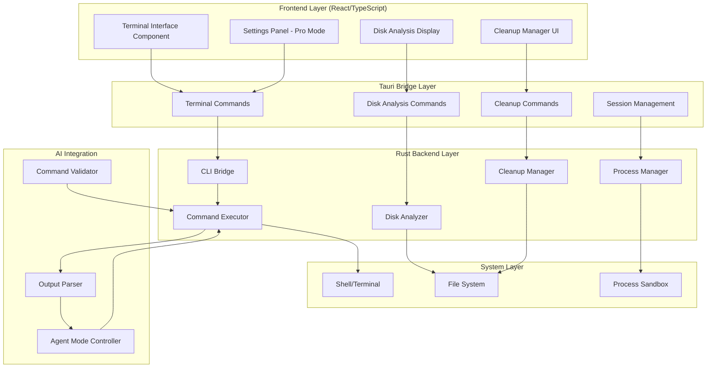

# Design Document

## Overview

The Terminal Integration and Disk Management system brings powerful CLI capabilities and disk analysis tools directly into Skhoot, combining the visual appeal of modern UIs with the power of command-line tools. The design follows a three-tier architecture: a Rust-based CLI bridge for secure terminal operations, a React-based frontend for beautiful visualizations, and an AI integration layer that enables Codex-style agent behavior.

The system is designed to be progressive - users can start with simple visual disk analysis and gradually unlock more powerful features through Pro Mode, including direct terminal access and AI-driven automation. The architecture emphasizes security through sandboxing, safety through confirmation mechanisms, and usability through intelligent defaults and clear visual feedback.

## Architecture

The system follows a layered architecture with clear separation between terminal operations, disk analysis, and UI presentation:



### Component Responsibilities

- **Frontend Layer**: Provides UI components for terminal interaction, disk visualization, and cleanup management
- **Tauri Bridge Layer**: Securely bridges frontend and Rust backend using Tauri commands
- **Rust Backend Layer**: Implements core logic for terminal operations, disk analysis, and cleanup
- **System Layer**: Interfaces with OS-level terminal, file system, and process management
- **AI Integration**: Enables agent mode with command validation and output parsing

## Components and Interfaces

### Terminal Interface Component (Frontend)

**Responsibilities**: Manages terminal display, tab management, and user interaction

**Key Features**:
- Embedded terminal view for AI-executed commands (no tabs, inline in chat)
- Tabbed terminal view for user-initiated terminals
- Terminal/conversation mode switching
- Real-time output streaming with ANSI color support
- Interactive input handling for commands requiring user input
- Session state persistence across view switches

**State Management**:
```typescript
interface TerminalState {
  terminals: Map<string, TerminalSession>;
  activeTerminalId: string | null;
  mode: 'chat' | 'terminal';
  proModeEnabled: boolean;
  showTerminalOutput: boolean;
}

interface TerminalSession {
  id: string;
  type: 'user' | 'ai';
  output: TerminalOutput[];
  status: 'running' | 'completed' | 'error';
  interactive: boolean;
}
```

### CLI Bridge (Rust)

**Responsibilities**: Secure interface between frontend and system terminal

**Key Methods**:
- `execute_command(cmd: String, args: Vec<String>) -> Result<CommandHandle>`
- `write_input(session_id: String, input: String) -> Result<()>`
- `read_output(session_id: String) -> Result<TerminalOutput>`
- `terminate_session(session_id: String) -> Result<()>`
- `list_active_sessions() -> Vec<SessionInfo>`

**Security Features**:
- Command validation and sanitization
- Configurable process sandboxing using OS-specific mechanisms
- Resource limits (CPU, memory, execution time)
- Dangerous command detection and blocking
- User confirmation for risky operations
- Sandbox enable/disable configuration with security warnings

### Disk Analyzer Component (Rust)

**Responsibilities**: Scans file system and generates space usage reports

**Analysis Strategy**:
1. **Directory Traversal**: Recursive scanning with configurable depth limits
2. **Size Calculation**: Uses apparent size for accurate space reporting
3. **Categorization**: Classifies files by type (caches, downloads, projects, app data)
4. **Safety Classification**: Rates cleanup candidates (safe, maybe, risky)
5. **Report Generation**: Creates structured reports with visualization data

**Key Data Structures**:
```rust
#[derive(Debug, Serialize, Deserialize)]
pub struct DiskAnalysisReport {
    pub total_size: u64,
    pub analyzed_paths: Vec<PathAnalysis>,
    pub top_consumers: Vec<SpaceConsumer>,
    pub cleanup_candidates: Vec<CleanupCandidate>,
    pub categories: HashMap<String, CategorySummary>,
    pub timestamp: DateTime<Utc>,
}

#[derive(Debug, Serialize, Deserialize)]
pub struct CleanupCandidate {
    pub path: PathBuf,
    pub size: u64,
    pub category: CleanupCategory,
    pub safety_level: SafetyLevel,
    pub description: String,
    pub estimated_savings: u64,
}

#[derive(Debug, Serialize, Deserialize)]
pub enum SafetyLevel {
    Safe,      // Caches, temp files - safe to delete
    Maybe,     // Old downloads, unused apps - user should review
    Risky,     // Projects, documents - requires careful review
}
```

### Cleanup Manager Component (Rust)

**Responsibilities**: Executes file deletion, compression, and archival operations

**Operation Types**:
1. **Deletion**: Moves files to trash/recycle bin (reversible)
2. **Compression**: Creates compressed archives using zstd or gzip
3. **Archival**: Creates tar archives with compression for long-term storage

**Safety Mechanisms**:
- Pre-operation validation and confirmation
- System file protection (prevents deletion of critical files)
- Integrity verification for archives before deleting originals
- Detailed operation logging
- Rollback capability for reversible operations
- Progress reporting with cancellation support

**Key Methods**:
```rust
impl CleanupManager {
    pub async fn delete_files(&self, paths: Vec<PathBuf>, use_trash: bool) -> Result<CleanupResult>;
    pub async fn compress_files(&self, paths: Vec<PathBuf>, algorithm: CompressionAlgorithm) -> Result<CleanupResult>;
    pub async fn create_archive(&self, paths: Vec<PathBuf>, dest: PathBuf, compression: CompressionAlgorithm) -> Result<CleanupResult>;
    pub async fn verify_archive(&self, archive_path: PathBuf) -> Result<bool>;
    pub async fn estimate_compression_ratio(&self, paths: Vec<PathBuf>) -> Result<f64>;
}
```

### Command Executor Component (Rust)

**Responsibilities**: Executes terminal commands with security and monitoring

**Execution Flow**:
1. **Validation**: Check command against whitelist/blacklist
2. **Confirmation**: Request user approval for dangerous commands
3. **Sandboxing**: Spawn process with security restrictions
4. **Monitoring**: Capture stdout/stderr, track resource usage
5. **Completion**: Return results to caller (AI or user)

**Agent Mode Integration**:
- Allows AI to execute approved commands
- Maintains command history for review
- Provides structured output for AI parsing
- Supports multi-step command sequences
- Enables iterative refinement on errors

**Dangerous Command Detection**:
```rust
const DANGEROUS_PATTERNS: &[&str] = &[
    "rm -rf /",
    "dd if=",
    "mkfs",
    "fdisk",
    "parted",
    "> /dev/",
    "chmod -R 777",
    "chown -R",
];
```

### Process Manager Component (Rust)

**Responsibilities**: Manages terminal sessions and process lifecycle

**Session Management**:
- Tracks active terminal sessions
- Manages process spawning and termination
- Handles resource cleanup
- Implements timeout mechanisms
- Provides session state queries

**Resource Management**:
- CPU and memory limits per process
- Maximum execution time limits
- Concurrent session limits
- Automatic cleanup of orphaned processes

## Data Models

### TerminalOutput Structure

```typescript
interface TerminalOutput {
  timestamp: Date;
  type: 'stdout' | 'stderr' | 'system';
  content: string;
  ansiFormatted: boolean;
}
```

### CommandHandle Structure

```rust
#[derive(Debug, Clone)]
pub struct CommandHandle {
    pub session_id: String,
    pub command: String,
    pub args: Vec<String>,
    pub pid: Option<u32>,
    pub status: CommandStatus,
    pub start_time: DateTime<Utc>,
}

#[derive(Debug, Clone, Serialize, Deserialize)]
pub enum CommandStatus {
    Pending,
    Running,
    Completed { exit_code: i32 },
    Failed { error: String },
    Cancelled,
}
```

### DiskAnalysisConfig Structure

```rust
#[derive(Debug, Clone, Serialize, Deserialize)]
pub struct DiskAnalysisConfig {
    pub paths: Vec<PathBuf>,
    pub max_depth: Option<usize>,
    pub follow_symlinks: bool,
    pub exclude_patterns: Vec<String>,
    pub min_size_threshold: u64,  // Ignore files smaller than this
    pub categorization_rules: HashMap<String, Vec<String>>,
}
```

### SecurityConfig Structure

```rust
#[derive(Debug, Clone, Serialize, Deserialize)]
pub struct SecurityConfig {
    pub sandbox_enabled: bool,
    pub resource_limits: ResourceLimits,
    pub dangerous_command_patterns: Vec<String>,
    pub require_confirmation_for_dangerous: bool,
}

#[derive(Debug, Clone, Serialize, Deserialize)]
pub struct ResourceLimits {
    pub max_cpu_percent: Option<u32>,
    pub max_memory_mb: Option<u64>,
    pub max_execution_time_secs: Option<u64>,
}
```

## Correctness Properties

*A property is a characteristic or behavior that should hold true across all valid executions of a system-essentially, a formal statement about what the system should do. Properties serve as the bridge between human-readable specifications and machine-verifiable correctness guarantees.*

### Property Reflection

After analyzing all acceptance criteria, several properties can be consolidated:
- Properties 1.1 and 12.2 both test Pro Mode button visibility (redundant)
- Properties 2.8 and 12.7 both test terminal output display in Pro Mode (redundant)
- Properties 3.2 and 3.4 can be combined into cleanup candidate presentation
- Properties 5.2 and 5.3 can be combined into command confirmation flow
- Properties 6.5 and 6.6 can be combined into session lifecycle management
- Properties 7.1, 7.2, and 7.3 can be combined into visual presentation formatting
- Properties 9.1 and 9.2 can be combined into confirmation dialog requirements

### Terminal Interface Properties

Property 1: Pro Mode terminal button visibility
*For any* UI state where Pro Mode is enabled, the terminal button should be rendered left of the prompt area
**Validates: Requirements 1.1, 12.2**

Property 2: Terminal view mode switching
*For any* terminal button click, the interface should switch to terminal view mode in the chat area
**Validates: Requirements 1.2**

Property 3: Conversation mode button presence
*For any* UI state in terminal mode, a conversation button should be displayed for switching back to chat mode
**Validates: Requirements 1.3**

Property 4: AI command embedded display
*For any* AI-executed command, the terminal output should be displayed embedded in chat without creating tabs
**Validates: Requirements 1.4**

Property 5: User terminal tab creation
*For any* user-initiated terminal opening, a new terminal tab should be created for navigation
**Validates: Requirements 1.5**

Property 6: Interactive terminal input handling
*For any* terminal displaying output, input handlers should be attached for commands requiring user interaction
**Validates: Requirements 1.6**

Property 7: Multi-terminal tab management
*For any* state with multiple open terminals, tab management should allow switching between all terminals
**Validates: Requirements 1.7**

Property 8: Terminal session state persistence
*For any* terminal session, switching views and returning should preserve the terminal state
**Validates: Requirements 1.8**

### Disk Analysis Properties

Property 9: Directory scanning and space calculation
*For any* disk analysis initiation, the analyzer should scan configured directories and calculate space usage
**Validates: Requirements 2.1**

Property 10: Directory traversal depth limiting
*For any* directory analysis with specified depth, traversal should stop at the configured depth level
**Validates: Requirements 2.2**

Property 11: Apparent size calculation
*For any* file size calculation, the analyzer should use apparent size rather than block size
**Validates: Requirements 2.3**

Property 12: Structured report generation
*For any* completed analysis, a structured report should be generated containing top space consumers
**Validates: Requirements 2.4**

Property 13: File categorization by type
*For any* analyzed file, it should be categorized by type (caches, downloads, projects, app data) based on its path
**Validates: Requirements 2.5**

Property 14: Safety level classification
*For any* cleanup candidate, it should be classified with an appropriate safety level (safe, maybe, risky)
**Validates: Requirements 2.6**

Property 15: Visual representation data generation
*For any* disk analysis presentation, visualization data structures should be generated for space usage display
**Validates: Requirements 2.7**

Property 16: Pro Mode terminal output display
*For any* disk analysis execution with Pro Mode enabled, terminal output should be displayed during execution
**Validates: Requirements 2.8, 12.7**

### Cleanup Management Properties

Property 17: Safe deletion candidate identification
*For any* completed analysis, the cleanup manager should identify files and directories that can be safely deleted
**Validates: Requirements 3.1**

Property 18: Cleanup candidate categorization and description
*For any* cleanup candidate, it should be categorized by type and include a clear description of what will be affected
**Validates: Requirements 3.2, 3.4**

Property 19: Space savings estimation
*For any* cleanup category, an estimate of space savings should be calculated
**Validates: Requirements 3.3**

Property 20: Cleanup operation execution
*For any* user-confirmed cleanup, deletion or compression operations should be executed
**Validates: Requirements 3.5**

Property 21: Cleanup progress reporting
*For any* executing cleanup operation, progress feedback and results should be provided
**Validates: Requirements 3.6**

Property 22: Risky operation confirmation requirement
*For any* risky cleanup operation, explicit user confirmation should be required before execution
**Validates: Requirements 3.7**

Property 23: Cleanup summary generation
*For any* completed cleanup, a summary report should be generated showing space reclaimed
**Validates: Requirements 3.8**

### File Search Integration Properties

Property 24: Backend file search integration
*For any* file search request, the disk analyzer should use the existing file search backend API
**Validates: Requirements 4.1**

Property 25: Search result completeness
*For any* search result, it should include file size, location, and last modified date
**Validates: Requirements 4.2**

Property 26: Search result action options
*For any* found file, action options (view, delete, compress) should be available
**Validates: Requirements 4.3**

Property 27: Pro Mode search command visibility
*For any* file search with Pro Mode enabled, search commands should be displayed in the terminal view
**Validates: Requirements 4.4**

Property 28: Search result report integration
*For any* completed search, results should be integrated into the overall disk analysis report
**Validates: Requirements 4.5**

### Agent Mode Properties

Property 29: Agent Mode command execution enablement
*For any* Agent Mode enabled state, AI should be able to execute approved terminal commands
**Validates: Requirements 5.1**

Property 30: Command display and confirmation flow
*For any* AI command execution request, the command should be displayed for review and wait for approval before execution
**Validates: Requirements 5.2, 5.3**

Property 31: Real-time output capture
*For any* executing command, output should be captured and displayed in real-time
**Validates: Requirements 5.4**

Property 32: Command error handling and retry
*For any* failed command, error messages should be provided and AI should be allowed to retry with corrections
**Validates: Requirements 5.5**

Property 33: Dangerous command confirmation
*For any* detected dangerous command, explicit user confirmation should be required
**Validates: Requirements 5.6**

Property 34: Agent Mode command history
*For any* Agent Mode execution, command history should be maintained for review
**Validates: Requirements 5.7**

Property 35: AI result return
*For any* completed terminal operation, results should be returned to AI in a structured format for further processing
**Validates: Requirements 5.8**

### CLI Bridge Properties

Property 36: Terminal session initialization
*For any* application startup, terminal session management structures should be initialized
**Validates: Requirements 6.1**

Property 37: Secure process spawning
*For any* command execution, processes should be spawned with proper security sandboxing
**Validates: Requirements 6.2**

Property 38: Output stream separation
*For any* command output capture, stdout and stderr should be streamed separately
**Validates: Requirements 6.3**

Property 39: Interactive command input support
*For any* interactive command, stdin should support user input writing
**Validates: Requirements 6.4**

Property 40: Session lifecycle management
*For any* terminal session, active terminals and their states should be tracked, and cleanup should properly terminate processes
**Validates: Requirements 6.5, 6.6**

Property 41: Detailed error reporting
*For any* error occurrence, detailed error information should be provided for debugging
**Validates: Requirements 6.7**

Property 42: Tauri command integration
*For any* frontend-backend communication, Tauri commands should be used for secure communication
**Validates: Requirements 6.8**

### Visual Display Properties

Property 43: Disk analysis formatting and visual indicators
*For any* disk analysis display, results should be presented in a well-formatted layout with visual indicators (bars, percentages) and color coding for safety levels
**Validates: Requirements 7.1, 7.2, 7.3**

Property 44: File list size sorting
*For any* displayed file list, items should be sorted by size with largest items first
**Validates: Requirements 7.4**

Property 45: Path truncation
*For any* displayed long path, it should be truncated intelligently for readability
**Validates: Requirements 7.5**

Property 46: Recommendation action buttons
*For any* presented recommendation, clear action buttons should be provided for user interaction
**Validates: Requirements 7.6**

Property 47: Analysis progress indicators
*For any* in-progress analysis, progress indicators and status updates should be shown
**Validates: Requirements 7.7**

Property 48: Result export functionality
*For any* ready analysis results, export options should be available for various formats (JSON, CSV, text)
**Validates: Requirements 7.8**

### Compression and Archival Properties

Property 49: Compression algorithm selection
*For any* compression operation, efficient algorithms (zstd, gzip) should be used
**Validates: Requirements 8.1**

Property 50: Tar archive creation
*For any* directory archival, tar archives should be created with appropriate compression
**Validates: Requirements 8.2**

Property 51: Compression space savings reporting
*For any* completed compression, space savings achieved should be reported
**Validates: Requirements 8.3**

Property 52: Archive metadata preservation
*For any* archive operation, file metadata and permissions should be preserved
**Validates: Requirements 8.4**

Property 53: Compression error handling
*For any* compression failure, clear error messages should be provided and originals should remain intact
**Validates: Requirements 8.5**

Property 54: Archive integrity verification
*For any* created archive, integrity should be verified before deleting originals
**Validates: Requirements 8.6**

Property 55: Compression ratio estimation
*For any* compression option presentation, compression ratios should be estimated
**Validates: Requirements 8.7**

Property 56: Archive destination options
*For any* user-confirmed archival, options for archive destination should be provided
**Validates: Requirements 8.8**

### Safety Mechanism Properties

Property 57: Destructive operation confirmation and affected items listing
*For any* destructive operation initiation, explicit user confirmation should be required and affected items should be clearly listed
**Validates: Requirements 9.1, 9.2**

Property 58: Reversible operation undo capability
*For any* reversible operation, undo capabilities should be provided
**Validates: Requirements 9.3**

Property 59: Trash usage for deletion
*For any* file deletion when possible, files should be moved to trash/recycle bin rather than permanently deleted
**Validates: Requirements 9.4**

Property 60: Risky pattern warnings
*For any* detected risky pattern, users should be warned with detailed explanations
**Validates: Requirements 9.5**

Property 61: System file protection
*For any* operation involving system files, deletion should be prevented and user should be warned
**Validates: Requirements 9.6**

Property 62: Operation logging
*For any* completed operation, detailed logs of actions taken should be provided
**Validates: Requirements 9.7**

Property 63: Error halting
*For any* error during cleanup, operations should halt and status should be reported
**Validates: Requirements 9.8**

### Backend Integration Properties

Property 64: Database result storage
*For any* analysis result storage, the existing database infrastructure should be used
**Validates: Requirements 10.3**

Property 65: Structured logging integration
*For any* operation logging, the existing structured logging system should be used
**Validates: Requirements 10.6**

### Codex-Style Agent Properties

Property 66: Multi-step command sequence execution
*For any* Agent Mode active state, AI should be able to execute multi-step command sequences
**Validates: Requirements 11.1**

Property 67: Codex CLI du command pattern support
*For any* disk space analysis, the same du command patterns as Codex CLI should be supported
**Validates: Requirements 11.2**

Property 68: Iterative command refinement
*For any* AI command error, iterative refinement of commands should be allowed
**Validates: Requirements 11.3**

Property 69: AI output availability
*For any* command output production, output should be made available to AI for analysis
**Validates: Requirements 11.4**

Property 70: Cleanup script safety execution
*For any* AI-generated cleanup script, execution should include proper safety checks
**Validates: Requirements 11.5**

Property 71: Interactive command prompt handling
*For any* interactive command need, user input prompts should be handled correctly
**Validates: Requirements 11.6**

Property 72: Long-running operation progress updates
*For any* long-running operation, progress updates should be provided to AI
**Validates: Requirements 11.7**

Property 73: Structured result return to AI
*For any* operation completion, structured results should be returned for AI processing
**Validates: Requirements 11.8**

### Pro Mode Settings Properties

Property 74: Pro Mode settings toggle
*For any* appearance settings access, a Pro Mode toggle should be provided
**Validates: Requirements 12.1**

Property 75: Pro Mode feature hiding
*For any* Pro Mode disabled state, advanced terminal features should be hidden
**Validates: Requirements 12.3**

Property 76: Agent execution configuration
*For any* Pro Mode configuration, enabling/disabling agent command execution should be available
**Validates: Requirements 12.4**

Property 77: Terminal visibility preferences
*For any* Pro Mode configuration, terminal visibility preferences should be settable
**Validates: Requirements 12.5**

Property 78: Immediate settings application
*For any* Pro Mode settings change, changes should apply immediately without restart
**Validates: Requirements 12.6**

Property 79: Keyboard shortcut terminal access
*For any* Pro Mode disabled state, manual terminal access via Shift+T keyboard shortcut should still work
**Validates: Requirements 12.8**

### Security Sandbox Configuration Properties

Property 80: Sandbox toggle availability
*For any* security settings access, a sandbox toggle control should be provided
**Validates: Requirements 13.1**

Property 81: Sandbox enforcement when enabled
*For any* command execution with sandbox enabled, OS-specific security restrictions should be applied to spawned processes
**Validates: Requirements 13.2**

Property 82: Sandbox bypass when disabled
*For any* command execution with sandbox disabled, processes should spawn without sandbox restrictions
**Validates: Requirements 13.3**

Property 83: Sandbox setting application
*For any* sandbox setting change, the new setting should apply to all subsequently executed commands
**Validates: Requirements 13.4**

Property 84: Security warning display
*For any* UI state with sandbox disabled, a warning about reduced security should be displayed
**Validates: Requirements 13.5**

Property 85: Dangerous command confirmation with sandbox disabled
*For any* dangerous command detection when sandbox is disabled, user confirmation should still be required
**Validates: Requirements 13.6**

Property 86: Security implications explanation
*For any* sandbox configuration access, clear explanations of security implications should be provided
**Validates: Requirements 13.7**

Property 87: Sandbox state change logging
*For any* sandbox state change, the configuration change should be logged for audit purposes
**Validates: Requirements 13.8**

## Error Handling

The system implements comprehensive error handling across all layers:

### Terminal Operation Errors
- **Command Not Found**: Clear error messages with suggestions for similar commands
- **Permission Denied**: Explain permission requirements and suggest solutions
- **Timeout Errors**: Configurable timeouts with clear timeout messages
- **Process Crashes**: Capture crash information and provide debugging details

### Disk Analysis Errors
- **Access Denied**: Skip inaccessible directories and log warnings
- **Disk Read Errors**: Handle I/O errors gracefully and continue analysis
- **Insufficient Permissions**: Clearly indicate which paths couldn't be analyzed
- **Out of Memory**: Implement streaming analysis for large directory trees

### Cleanup Operation Errors
- **Deletion Failures**: Rollback partial operations and report failures
- **Compression Errors**: Preserve originals and provide detailed error messages
- **Archive Corruption**: Detect corruption before deleting originals
- **Disk Full**: Check available space before operations

### Security Errors
- **Dangerous Command Detection**: Block execution and explain why
- **Sandbox Violations**: Terminate processes attempting to escape sandbox
- **Resource Limit Exceeded**: Kill processes exceeding limits and notify user

## Testing Strategy

The testing approach combines unit testing and property-based testing to ensure comprehensive coverage:

### Unit Testing
- **Component Integration**: Test interactions between CLI bridge, disk analyzer, and cleanup manager
- **Tauri Command Testing**: Verify all Tauri commands work correctly from frontend
- **UI Component Testing**: Test React components with various states and props
- **Error Condition Testing**: Test specific error scenarios and edge cases
- **Security Testing**: Verify sandboxing and dangerous command detection

### Property-Based Testing
- **Terminal Operation Properties**: Test command execution across various command types and arguments
- **Disk Analysis Properties**: Verify analysis correctness across different directory structures
- **Cleanup Properties**: Test cleanup operations with various file types and sizes
- **Safety Properties**: Verify confirmation and protection mechanisms work correctly
- **Agent Mode Properties**: Test AI command execution and output parsing

### Testing Configuration
- **Property Test Iterations**: Minimum 100 iterations per property test for statistical confidence
- **Test Data Generation**: Smart generators that create realistic file structures and commands
- **Performance Testing**: Measure and validate disk analysis and cleanup performance
- **Integration Testing**: End-to-end testing of complete workflows from UI to system operations

### Test Tagging Format
Each property-based test must include a comment referencing the design document property:
```rust
// Feature: terminal-disk-management, Property 1: Pro Mode terminal button visibility
```

The testing strategy ensures both functional correctness through property-based testing and practical reliability through comprehensive unit testing of edge cases and error conditions.
